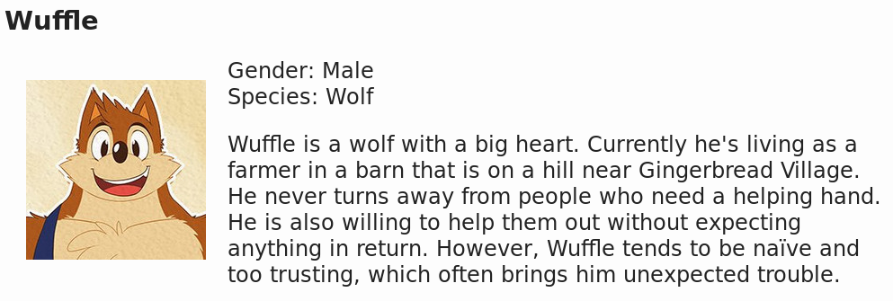
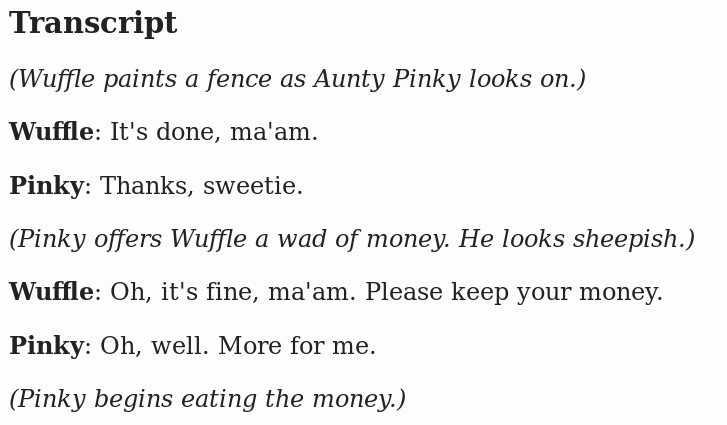

# How to use Springheel

This is a walkthrough for getting Springheel working, setting up a comic site, and updating it. (Using an FTP program, registering a domain name, creating an SSH key, etc. are outside the scope of this guide.)

## Get Springheel

Springheel requires at least **Python 3.** It will not work with Python 2, which is still the default  version on many flavors of GNU/Linux, so watch out.

To install from PyPi, simply run

    $ pip install springheel

To install from source, you'll need the following dependencies:

* [Feedgenerator](https://github.com/lkiesow/python-feedgen)
* [awesome-slugify](https://github.com/dimka665/awesome-slugify)

Navigate to the springheel directory, and run `setup.py install` (you may need to run this with `su -c` depending on the type of Python install you have).

**Important**: If you're on Windows and get an error about Visual C++ while installing dependencies (lxml especially), do not panic! Just use PyPi to install that specific library directly, then try to install springheel again.

If I release a new major version of Springheel, that means you should re-initialize any existing comic sites after updating, as there were most likely changes to the themes or template files.

## Limitations

Springheel is designed to be as simple and bare-bones as possible, so there are some features it doesn't have (or just doesn't have *yet*). E.g.:

* There is no real tagging system; if you enter anything into the metadata field "tags", it's just displayed as plain text, and there is no way to browse pages by tag.
* The RSS feed may list items out of order if multiple comics have the same posting date.
* Page commentaries and character descriptions are plain text only (no HTML). This is because parsing markup in those blocks would be *much* more complicated and slow.
* Comic pages must be one image each -- you can't yet create "webtoon"-style comics that are split up into multiple images, and have them all display on one page. I've included hooks to change this eventually, at least.
* Templates have not been translated into many languages yet; so far, they're only available in the languages I personally speak. You also can't have a single site with multiple languages yet.
* There is no out-of-the-box support for ads or analytics.
* RSS feeds are sitewide (as opposed to one for each individual series out of many) and bare-bones. They don't display thumbnails of the comic, the strip itself, or anything along those lines. (But this may actually be your desired behavior for RSS feeds, in which case, super!)
* Pages do not use any kind of modernizer or polyfill, so they will not look *exactly* the same in older browsers that they do in bleeding-edge new ones. They'll still be perfectly usable, just a bit less fancy. (I *have* tested them on common "old" browsers, so don't worry.)

# Building a site for Wuffle

I've provided a sort of "sample site" pack based on a few strips from *Wuffle*, a cute comic which is public domain. [Download it here](https://twinkle-night.net/Downloads/springheel-wuffle-sample-site-pack.zip) and let's walk through the process of using it, step-by-step.

## Initialization

To start off, make a directory for this project, and navigate there in your terminal of choice. (You should probably put the ZIP file here to make sure you don't lose it.)

Next, we'll run the initialization script. On GNU/Linux this is simply:

    $ springheel-init

On Windows, add Python to your path if you haven't already, run the `springheel-init.exe` script -- it is located in the `Scripts` folder of your Python install path. The command might look something like this:

    C:\Python35\Scripts\springheel-init.exe

I know this is a bit of a mouthful compared to the GNU/Linux version, sorry.

If all goes well, a prompt will appear in your terminal asking for the (ISO 639-1 two-letter code for the) language your site will use. *Wuffle* is in English, so type "en" and press enter. Some debug info will appear explaining what is going on: the script locates where Springheel was installed, grabs the templates and other base assets for the language in question, and copies them to your current directory.

Now unzip the contents of the *Wuffle* pack, `springheel-wuffle-sample-site-pack.zip`, into the current directory. Everything in it *except* the `wuffle_conf.py` file should go into `input`. Remove the current `conf.py` file and rename `wuffle_conf.py` to simply `conf.py`.

Your directory should now look something like this:

    .:
    arrows/
	input/
	socialbuttons/
	templates/
	themes/
    conf.py

Let's look at each of these in more detail. You can also skip right down to "Trying to build" and work out this stuff once you already have a generated site to compare it to; the choice is yours.

### Base directory

This holds the sitewide configuration file and the input and output folders.

`conf.py` is a sitewide configuration file. You'll definitely want to modify it before building, as we've done here -- some of the defaults are deliberately silly or non-working.

### Asset folders

`arrows` holds the navigation buttons -- they follow the scheme {theme}_{direction}. You can easily make your own if you don't like the defaults.

Social buttons are 24x24 icons that are used to link to social media sites, like Twitter or Pump. These are also simple to customize. Adding a site that isn't supported is a bit more involved but still entirely possible.

### Input

As per the name, this holds the comic files (images and metadata). Site banners and such go here as well. Right now, this should contain:

* 10 comic images
* 10 .meta files
* 10 .transcript files
* 1 .conf file
* 1 .chars file
* 2 heading/banner images

### Templates

These are the templates used to generate the finished pages. One is a JSON file that contains all the translations, and the rest are HTML files.

As long as they're not based on machine translations, pull requests for languages I haven't provided are welcome!

### Themes

Themes determine the look and feel of your site. I've tried to include a variety of default themes, while also keeping each theme **small** (only a couple of themes are over 50KiB; most are under *15* KiB) and **simple** enough to make your own themes that hook into the existing code easily. They also use color schemes that pass WCAG AAA-level standards for text contrast (no thin cyan text on a white background here), and should also look fine on most small screens.

Our *Wuffle* example uses the `plain` theme for simplicity, but it's by no means the only option.

#### Defaults

Springheel comes equipped with a whopping 20 default themes, in order to match a wide variety of comic genres. They're all written with [Sass](https://sass-lang.com/), then compiled to a Cascading Style Sheet. (This is done separately from the comic generation process; Springheel does not contain a Sass parser.)

These are the themes available by default:

* plain -- an extremely simple theme. Uses no images. 7.6KiB + 3.6Kib arrows.
* dark -- a simple dark theme. Uses no images. 8.1KiB + 3.4KiB arrows.
* beach -- a relaxed and fun theme inspired by the blue ocean. 41KiB + 7.8KiB arrows.
* book -- an elegant theme inspired by hardbound books. 17.2KiB + 2.8KiB arrows.
* brandy -- a hard-boiled noir theme of stark light and darkness. 11.1KiB + 23.1KiB arrows.
* cherry -- a girly pink theme for shoujo dreamers. 21.2KiB + 13.1KiB arrows.
* city -- a dreamy, twinkly theme. 10.2KiB + 735B arrows.
* cute -- a cute, candy-themed pink and brown theme. Might be good for comics about sweets or children. 10.5KiB + 4.5KiB arrows.
* cyber -- a theme inspired by 90s cyberpunk. 10.5KiB + 7.7KiB arrows.
* fantasy -- a lush theme with green, gems, and parchment, perfect for "high fantasy" comics. 24.2KiB + 18.2KiB arrows.
* garden -- a soothing floral theme. **Warning: large theme.** 129.9KiB + 17.7KiB arrows.
* gothic -- featuring blood, roses, and bloody roses. 18.7KiB + 19.2KiB arrows.
* haunted -- a slightly cute, slightly spooky theme inspired by haunted houses. Suited for comedic horror comics. 24.2KiB + 38.5KiB arrows.
* magiccircle -- a mysterious, fantastical theme. **Warning: large theme.** 79.4KiB + 16.2KiB arrows.
* note -- a striking, modern theme, designed to look "native" on phones. Uses no images. 12.3KiB + 3.5KiB arrows.
* prayers -- a peaceful theme in the image of a Shinto shrine. Mostly included because fans of a certain scrolling-shooter game might prefer red-white over black. ^\_\- 18.5KiB + 27.5KiB arrows.
* rock -- a theme with plenty of star power, perfect for comics involving three chords and cowboys of the rhinestone variety. 15.8KiB + 22.1KiB arrows.
* showtime -- a dramatic theme based on theatrical staging. 18.9KiB + 6.7KiB arrows.
* starship -- a retro sci-fi theme with stars and metal. 11.8KiB + 700B arrows.
* steam -- a "steampunk" theme with plenty of gears. 17.6KiB + 8.2KiB arrows.
* twothousand -- a theme inspired by typical comic site designs from the early 2000s. Uses no images. 12.7KiB + 4.4KiB arrows.
* seasonal -- a theme you can change to match the seasons. **Requires configuration before use.** ~8KiB each + 1.6KiB arrows.
* western -- a rugged theme fit for a cowpoke. 14.7KiB + 18.6KiB arrows

To use any of these themes, just enter its name as `site_style` in `conf.py`. Plain is the default.

If your site contains multiple comic series, you can even set individual styles for each one; just set "theme" in that comic's `.conf` to the theme name you want.

#### Customizing

If you're OK with a default theme with some tweaks, make a backup copy of that theme's `style.css` (or its base .scss if you prefer) just in case, then fiddle around with the CSS as much as you want. Springheel copies the `style.css` file from your selected theme as part of the generation process, so make sure to run it once you're done.

`note` is specifically designed to be easily customized -- check the comments near the top of the CSS file.

`seasonal` is different from the others; it comes in four sub-styles. They're more or less the same, just with different colors and background images. To use one, copy one of the four (`spring.css`, `summer.css`, `autumn.css`, or `winter.css`) to `style.css`. (If you want to change to a different sub-style later, simply remove the current `style.css` and make another copy.)

#### Rolling your own

Creating your own styles is simple enough. Here's what you must do:

1. Go to the `themes` directory, and make a folder there with the title of your theme. It must be a unique name, all lowercase, and without spaces.
2. Create a file there called `style.css`. How you create `style.css` does not matter, as long as it is called that and in the right place. For neatness and ease of memory, I usually use Sass to make a .scss file in `themes`, and have it compile to a `style.css` in a matching directory (e.g. themes/plain.scss:themes/plain/style.css). If you're using any, put all other assets, like images, in the same directory as `style.css` too.
3. Design your cool CSS theme. This is the easy part. :)
4. Make a set of navigation arrows and put them in `arrows`. For compatibility with Springheel's code, they should be like this (even if you want the arrows to point the other way, just follow this schema, open up `conf.py`, and set `navdirection` to `rtl`):
 * {yourtheme}_first.png (pointing **left**)
 * {yourtheme}_prev.png (pointing **left**)
 * {yourtheme}_next.png (pointing **right**)
 * {yourtheme}_last.png (pointing **right**)
5. **Test out your theme.** Run your colors through [WebAIM's Color Contrast Checker](http://webaim.org/resources/contrastchecker/). See what it looks like when zoomed in or out really far. If you can, check what it looks like on different browsers and devices, or with automatic image-loading turned off. Ask friends for help if you need to. Try to validate your stylesheet; it doesn't necessarily have to follow W3's official specification, but there ought to be a good reason why it doesn't.
6. No, really, actually do #5. Your readers will thank you.
7. Set `site_style` to the theme name you decided on in step 1 and run Springheel to regenerate your comic. Your comic site will now be themed with your own, custom theme!

One thing to keep in mind that you may have noticed already: each theme's CSS is wrapped in an ID selector, and pages that use a given theme set the ID of `html` to that theme's name. (So, a page that uses the "plain" style will have "`<html lang="[whatever]" id="plain">`, and plain's `style.css` only applies to elements within `#plain`.) If you don't do the same, and your site uses multiple themes, it won't display correctly at all and will look very weird.

### Setting comic metadata

The comic images and their metadata will end up in `input`. Any page should have two matching text files, which have the same filename and a different extension: .meta  and .transcript.

There will also be a third file, .conf, that applies to the series as a whole rather than a single strip, and you can optionally declare a .chars file that will generate a series character page. If your comic is divided into chapters, you can also add a .chapters file that maps chapter numbers to chapter titles.

The .meta file will have various key metadata about the comic (and the author's commentary, if applicable), while the .transcript is, as the name suggests, a textual transcript of the comic's action and dialogue. The .conf file contains important preferences about the series. The syntax for these files is fairly straightforward.

For this example, let's use a specific [Wuffle comic](http://www.wufflecomics.com/2012/03/wuffle-and-aunty-pinky-2/) -- look for `Wuffle_2012-03-21-2012_0004_Aunty.jpg` and its related files in the `input` directory.

Here's what `Wuffle_2012-03-21-2012_0004_Aunty.meta` looks like:

	---
	  title: Wuffle and Aunty Pinky
	  author: Piti Yindee
	  email: <expunged>
	  date: 2012-03-21
	  tags: 4 panel series 1, Aunty Pinky, Wuffle
	  conf: Wuffle.conf
	  category: Wuffle
	  page: 4
	  height: 1429
	  width: 1000
	  language: en
	  mode: default
	  chapter: 1
	  alt: This is a test of the extra text system.
	---
	Meet the new Wuffle's neighbor, Aunty Pinky aka the money hunger!

Here's the transcript file, `Wuffle_2012-03-21-2012_0004_Aunty.transcript`:

	(Wuffle paints a fence as Aunty Pinky looks on.)
	
	Wuffle
	  It's done, ma'am.
	
	Pinky
	  Thanks, sweetie.
	
	(Pinky offers Wuffle a wad of money. He looks sheepish.)
	
	Wuffle
	  Oh, it's fine, ma'am. Please keep your money.
	
	Pinky
	  Oh, well. More for me.
	
	(Pinky begins eating the money.)

And finally `Wuffle.conf`, the configuration file for the *Wuffle* series in general:

    [ComicConfig]

	category = Wuffle
	author = Piti Yindee
	email = <expunged>
	header = WuffleHeader.jpg
	banner = WuffleHeader.jpg
	language = en
	mode = default
	status = complete
	chapters = Wuffle.chapters
	desc = Public domain funny animal comic
	chars = Wuffle.chars
	license = To the extent possible under law, Piti Yindee has waived all copyright and related or neighboring rights to Wuffle Comic.
	license_uri = http://creativecommons.org/publicdomain/zero/1.0/

In .meta files, the metadata is sandwiched between the `---` lines; below that is the author's commentary. The strictly needed fields are:

* **title** (the title of this specific strip or page)
* **author** (you! or rather, whoever is supposed to get the credit for posting a page)
* **email** (your email address -- this is needed for RSS feed generation)
* **date** (the strip's publication date, in ISO 8601 (YYYY-MM-dd) format)
* **category** (the comic/series title)
* **page** (this strip's page number)
* **language** (ISO 639-1 code)

You can also add a `chapter` number if this strip is part of a chapter. 

The .transcript has the character names, their dialogue indented by 2 spaces, and actions offset by parentheses. As long as it follows this scheme, it'll be parsed by the HTML transcript generator.

The .conf file has fields that are required for accurate copyright statements, RSS feed generation, and general series organization:

* **category** (the name of the series)
* **author** (again: you!)
* **email** (your email address)
* **header** (a header image that will appear at the top of this series' pages)
* **banner** (a banner to identify this series; can be the same as the header or different)
* **language** (ISO 639-1 code)
* **chapters** (whether or not the comic is divided into chapters. If you set this to True *or* the name of a .chapters file, the archives page will automatically be separated by chapter)
* **desc** (a description of the comic; used for the index page and RSS feeds)
* **status** (whether the series is finished or not; accepted values are `in-progress`, `complete`, and `dead`)
* **chars** (optional; the filename of a .chars file. If characters_page in `conf.py` is set to True, this will generate a characters page based on the linked file.)

### Character pages

Webcomics are notorious for having out-of-date character pages, so I made them as easy as possible for Springheel. Here's all you have to do:

1. Make a file to hold your character markup in `input`. I'd recommend calling it with the name of the series and the file extension `.chars` to make it easy to remember. Let's use Wuffle.chars for this example.
2. Add the category and language to the top of the characters file, followed by a line with "`---`".

        category: Wuffle
        lang: en
        ---

3. Add characters! The syntax is very simple. Mark character names with `name:` and a short description or blurb with `desc:`. You can optionally add a picture of the character with `img: image_filename.ext`. (If you don't want an image, use `img: None` instead.) Add a line with just `---` after each character to separate them.
4. The default attributes -- name and description, and optionally an image -- will be fine for a basic characters page. But you can add any other, custom text attributes you want, and they'll be displayed too! All you have to do is type the attribute label you want, followed by a colon, and then the value (one attribute per line). Let's suppose I want to include a "species" field because the *Wuffle* characters are anthropomorphized animals. For Wuffle himself, I'd add `Species: Wolf`. Simple! All custom attributes are put into their own little subsection in the compiled page.
3. Add a line to the comic's configuration file (Wuffle.conf in this case) pointing to the character file:

        chars = Wuffle.chars

4. Run Springheel as normal. You're done! The character page will now be generated.

So this character file:

    category: Wuffle
    lang: en
    ---
    name: Wuffle
    desc: Wuffle is a wolf with a big heart. Currently he's living as a farmer in a barn that is on a hill near Gingerbread Village. He never turns away from people who need a helping hand. He is also willing to help them out without expecting anything in return. However, Wuffle tends to be naïve and too trusting, which often brings him unexpected trouble.
    img: char-wuffle.jpg
    Gender: Male
    Species: Wolf
    ---
    ...

Would generate a character page like this:

    <div class="char">
        <h2>Wuffle</h2>
        
        <dl>
            <dt>Gender</dt>
            <dd>Male</dd>
            <dt>Species</dt>
            <dd>Wolf</dd>
        </dl>
        <p>Wuffle is a wolf with a big heart. Currently he's living as a farmer in a barn that is on a hill near Gingerbread Village. He never turns away from people who need a helping hand. He is also willing to help them out without expecting anything in return. However, Wuffle tends to be naïve and too trusting, which often brings him unexpected trouble.</p>
    </div>
    ...

Which looks like this in the Plain style:



### Chapter titles

If you want your chapters to have titles -- rather than simple numbers -- you'll need a .chapters file. As described above, add a `chapters: Wuffle.chapters` line to `Wuffle.conf`, then create a file called `Wuffle.chapters`.

Suppose we want the first chapter to be called "4-Panel Series 1". We'll add the following line to `Wuffle.chapters`:

 	1 = 4-Panel Series 1
 
 That's it! That title will appear on the archive page, as well as in the headings for all pages that are marked as being part of chapter 1.

## Extras

Springheel allows you to create a page to hold various extras. The main use case I was imagining was for guest art, wallpapers, textual side-stories, etc., but you can really put anything you want there.

To create an extras page, pop open `conf.ini` and set `extras_page` to `True`. Then put a JSON file called `Extra.json` in `input`. Here's an example extras file for my sister's comic, *Brutus*:

```{
  "Fanart":[
    {"title":"Alucanth","desc":"The very first Brutus fanart was a wonderful Alucanth by garrick!","type":"image","files":["garrick_fanart_01.png"]},
    {"title":"Brutus MS Paint Poster","desc":"Also by garrick: a big poster!","type":"image","files":["garrick_fanart_02.png"]},
    {"title":"Just As Brutus'd","desc":"Bardum contributes an amusing parody...","type":"image","files":["bardum_fanart_01.png"]}
  ],
  "Comic":[
    {"title":"Brutus Comic Book Archive","desc":"CBZ files for offline viewing. Read them with most any modern document viewer.","type":"file","files":[{"path":"Brutus_-_1-8.cbz","link":"Brutus Chapters 1-8 [2.2M]"},{"path":"Brutus_Gaiden.cbz","link":"Brutus Gaiden [incomplete, 132.7K]"}]}
  ]
}```

That will generate an extras page with Comic and Fanart as the second-order headings. `file`-type items will appear as textual links, and `image`-type ones will appear as image elements with figcaptions.

### Licensing

You are by no means required to relinquish the copyright of a comic simply because you built the site for it with Springheel. The licensing of your work is *entirely* your decision.

That being said, I want to promote [Free Cultural Works](https://freedomdefined.org/Licenses) in general, so Springheel comes with some tools to make it easier to indicate the rights that readers have.

First off, there is a field, `license`, in `conf.py`. By default it is "All rights reserved". But if you want to release your comic into the public domain, as Piti Yindee did for *Wuffle*, you could do something like this:

	license = To the extent possible under law, Piti Yindee has waived all copyright and related or neighboring rights to Wuffle Comic.

Note: if you are releasing your comic into the public domain, *please* make sure to edit `country` in `conf.py` to list the country you are publishing from! This is very important because different countries have different laws about the ability of authors to waive copyright.

If you'd rather use a Creative Commons license, you could add the HTML snippet from their [license chooser](https://creativecommons.org/choose/), as I do on my own site:

	license = <a rel="license" href="http://creativecommons.org/licenses/by-sa/4.0/"></a> These <span xmlns:dct="http://purl.org/dc/terms/" href="http://purl.org/dc/dcmitype/StillImage" rel="dct:type">works</span> by <span xmlns:cc="http://creativecommons.org/ns#" property="cc:attributionName">Garrick</span> are licensed under a <a rel="license" href="http://creativecommons.org/licenses/by-sa/4.0/">Creative Commons Attribution-ShareAlike 4.0 International License</a>.

We add info on the license to the comic's `.conf` file as well. For public domain works this will be the waiver from before, as well as a U.R.I. In *Wuffle*'s case this might be:

	license = To the extent possible under law, Piti Yindee has waived all copyright and related or neighboring rights to Wuffle Comic.
	license_uri = http://creativecommons.org/publicdomain/zero/1.0/

For a Creative Commons license, it will be the license's name and U.R.L.:

	license = Creative Commons Attribution-ShareAlike 4.0
	license_uri = http://creativecommons.org/licenses/by-sa/4.0/

Now your comic will be nicely marked up with human- and machine-readable license info!

## Trying to build

Whew! That was quite a bit of text without actually getting to *do* much. For now, let's just try building the site with the configurations and preferences already present in the *Wuffle* sample pack's files. It should work out of the box, after all.

You run `springheel-build` in much the same way as `springheel-init`:

On GNU/Linux, it's `$ springheel-build`

On Windows it's `<Your Python install path>\Scripts\springheel-build.exe`

Now just sit back and wait for the site to compile.


### Checking the output

If `springheel-build` didn't return any errors, your site *should* appear in `output/`.

Let's look at the same strip as before. Here's the navigation block, used above and below the comic:

	<ul class="cominavbox">
	<li><a href="wuffle_1.html"></a></li>
	<li><a href="wuffle_3.html"></a></li>
	<li><a href="wuffle_5.html"></a></li>
	<li><a href="wuffle_171.html"></a></li>
	</ul>

You don't have to calculate any of this yourself; it's generated automatically!

Meanwhile, the .transcript will generate the following HTML:

	<div role="region" id="transcript" aria-label="Transcript"><h2>Transcript</h2>
	<p class="action">(Wuffle paints a fence as Aunty Pinky looks on.)</p>
	<p class="line"><span class="charname">Wuffle</span>: 
	<span class="linedia">It's done, ma'am.</span></p>
	<p class="line"><span class="charname">Pinky</span>: 
	<span class="linedia">Thanks, sweetie.</span></p>
	<p class="action">(Pinky offers Wuffle a wad of money. He looks sheepish.)</p>
	<p class="line"><span class="charname">Wuffle</span>: 
	<span class="linedia">Oh, it's fine, ma'am. Please keep your money.</span></p>
	<p class="line"><span class="charname">Pinky</span>: 
	<span class="linedia">Oh, well. More for me.</span></p>
	<p class="action">(Pinky begins eating the money.)</p>
	</div>

Which will look something like this in the wild (again, with the Plain style):



## From here on

That should be that; you should have a usable site with all of Springheel's basic features. At this stage, you can fiddle around with the settings, make your own themes or assets, and use the Wuffle files as a sort of template for what your own comic files should look like. When you have a site you're satisfied with, you can upload it to your webserver with the FTP/SSH/etc. client that you like best.

### Updating

Updating your Springheel site is simple. Just add the new strip(s) and metadata files to `input`, then run `springheel-build` again. Then you can re-upload your newly-updated site and marvel at your RSS feed.

**NOTE:** Springheel rebuilds and recopies *everything* every time you update -- if you've made any changes to files in `output`, they'll be overwritten!

# FAQ

**Q. Must I include a transcript for every strip?**

A. No, you don't *have* to include any transcripts. You can absolutely build a Springheel site without a single one. But it's still **highly** recommended. Without any searchable plain text for your comics:

* You'll take a huge hit to accessibility and SEO.
* Readers will have a harder time looking up words or phrases they don't know.
* People looking for a specific strip based on a piece of remembered dialogue will have to just give up and hate you forever.
* The "no transcript found" block that Springheel inserts when it can't find a .transcript might make you look silly.

---

**Q. I'm on a Mac and...**

A. I don't use Apple products, so I can't really provide support or troubleshooting for them. Sorry.

---

**Q. I get weird encoding errors when I run Springheel through the Windows command line! What should I do?**

A. I've done my best to mitigate this, but it is a recurring problem on Windows' end that is unfortunately unlikely to ever be fixed. [Look up how to enable Unicode in the command line](https://duckduckgo.com/?q=windows+command+line+enable+unicode) for your version of Windows, and that should fix it.

---

**Q. I have translated my comics into different languages. How can I include them all on my Springheel site?**

A. This is the method I use:

1. Generate separate sites for each language.

2. Put each one in its own directory (./en, ./ja, ./de).

3. Use a bit of sed/awk wizardry to point all assets to a central location, to save on bandwidth.

It's admittedly a bit kludgey, and in the future I'd like to implement a more straightforward method for multiple-language sites.

---

**Q. The date format you use is weird!**

A. That's not a question! But Springheel's date format -- a four-digit year, two-digit month, and two-digit day, in that order -- follows the ISO 8601 specification for date display. I happen to personally like this format, but that's quite aside from the fact that it is the official, internationally-recognized, unambiguous standard. (See also [XKCD's take on the matter](https://xkcd.com/1179/).)

---

**Q. Why is the text so big?**

It's more like other sites' text is [too small](https://blog.marvelapp.com/body-text-small/). I'm *very* nearsighted, so I designed the Springheel themes to display text at a size I could personally read easily.

---

**Q. Why doesn't Springheel keep track of the time a comic was published, instead of just the date?**

A. No matter what, there is going to be a gap between the listed time and the time when it was uploaded to the server. I didn't want to pretend a degree of accuracy and precision that wasn't actually there.

---

**Q. Can you recommend a good web host?**

A. I'm not too familiar with free hosting if that's what you're after. But if you do have a hosting budget and are technically adept, I highly recommend [NearlyFreeSpeech](http://nearlyfreespeech.net) -- their pricing is very reasonable, their service is consistent (pretty much no downtime in my experience), and they offer many useful services for the privacy-conscious.

---

**Q. Why don't the navigation arrows come with hovered versions?**

A. The conventional method for adding image hover effects is inflexible, crufty, non-semantic, and [inaccessible](https://www.paciellogroup.com/blog/2012/08/notes-on-accessible-css-image-sprites/), and icon fonts are even worse (c.f. [Icon font accessibility](https://fvsch.com/code/icon-font-a11y/), [Ten reasons we switched from an icon font to SVG](http://ianfeather.co.uk/ten-reasons-we-switched-from-an-icon-font-to-svg/), [CSS generated content is not content](http://www.karlgroves.com/2013/08/26/css-generated-content-is-not-content/)). If there is a semantic, pure HTML+CSS solution that allows for alt text, without setting a million exact `px` values or creating empty non-semantic elements, I'm all ears.

At the very least, the "note" and "seasonal" themes' arrows change color on hover.

---

**Q. Why doesn't Springheel use JavaScript? If you used JS you could do \<blah blah\>...**

A. I know this is a matter of preference, but frankly speaking, I just don't like JavaScript. In fact, one of my goals with Springheel is to show that you can make a cool, perfectly usable site without a lick of JavaScript.

JavaScript is overused for all sorts of purposes it's not remotely suited for, contributing to loading bloat and making code harder to maintain. There is nothing wrong with plain old HTML (especially for static text and images, as Springheel sites mostly are), and anyone who tries to convince you that "it's $year, your site MUST have the flavor of the month!" is selling something.

JavaScript also poses numerous [security hazards](https://arstechnica.com/security/2016/12/millions-exposed-to-malvertising-that-hid-attack-code-in-banner-pixels/) and even [copyright problems](https://www.gnu.org/philosophy/javascript-trap.html), so I wanted vanilla Springheel sites to be perfectly usable even with JavaScript turned completely off. Even if you want really fancy effects, [you might not need JavaScript](http://youmightnotneedjs.com/).

There is one use case that requires JS, but it's also the one thing I can't have Springheel work out on its own: serving up ads. Because virtually every ad service is different (what kind of script is it? Where does it go? What dependencies and other assets does it need?) there's no single, agreed-upon way for Springheel to insert the ad code. For now my recommendation is just reading up on sed, awk, or Perl and making a script to add the snippets for you. (Who knows? If Springheel ever becomes popular, maybe there'll be plugins one day that'll make this process easier.)

---

**Q. Why do extra pages, and only extra pages, use JSON when everything else uses some vaguely YAML-like crap?**

Because I am a dumb ass.


